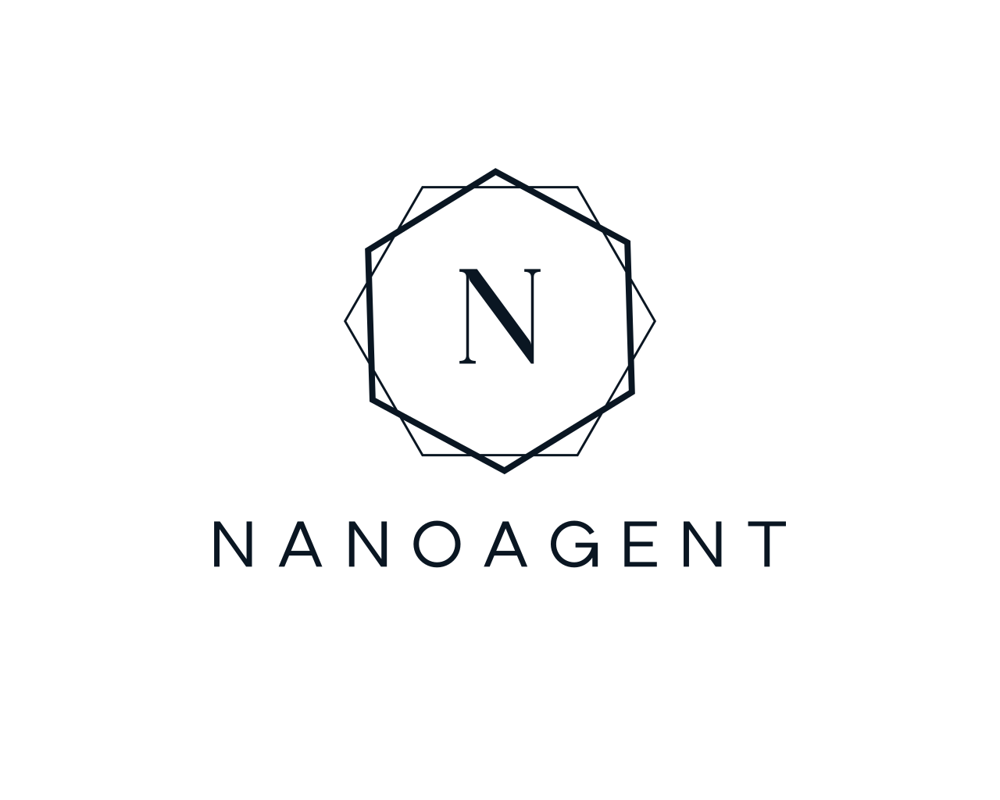

<p align="center">
  <picture>
    <source media="(prefers-color-scheme: dark)" srcset="logos/logo_transparent_white.png">
    
  </picture>
</p>

<h1 align="center">NanoAgent PHP</h1>

<p align="center">
  <a href="https://github.com/hammrouni/nanoagentphp/actions/workflows/ci.yml"></a>
  <a href="https://packagist.org/packages/hammrouni/nanoagent"></a>
  <a href="https://packagist.org/packages/hammrouni/nanoagent"></a>
  <a href="https://github.com/hammrouni/nanoagentphp/blob/main/LICENSE"></a>
  <a href="https://packagist.org/packages/hammrouni/nanoagent"></a>
  <a href="https://github.com/hammrouni/nanoagentphp"></a>
  <a href="https://github.com/hammrouni/nanoagentphp/issues"></a>
</p>

<p align="center"><strong>Add AI agents to your PHP app in an afternoon - local-first, no Python sidecar, no framework to learn.</strong></p>

<p align="center">
  <code>composer require hammrouni/nanoagent</code> &nbsp;·&nbsp; PHP 8.0–8.4 &nbsp;·&nbsp; 0 runtime dependencies &nbsp;·&nbsp; MIT
</p>

---

<p align="center"><a href="https://hammrouni.github.io/nanoagentphp/">📖 Full documentation &amp; interactive examples</a></p>

## Why this exists

## Why this exists

Most "AI agent" libraries assume you'll bolt a Python microservice behind your app, manage a fleet of config files, or adopt a whole framework. In existing PHP environments - where your service is already talking to legacy databases, internal APIs, and core business logic - that overhead is the wrong shape. You don't need a sidecar. You need a small, boring, local library you can `composer require` into the PHP you already run, hand it your own functions, and ship.

NanoAgent is that library. It is deliberately **lightweight and local-first**: one Composer package, zero runtime dependencies, no DSL, no framework lock-in, and memory that lives in your own files or database. It points at whichever provider you configure - a hosted API *or* a local model behind a compatible endpoint - so the agent can run right alongside your existing infrastructure.

## What it does

* **⚡ One config array, any provider.** OpenAI, Groq, Anthropic, DeepSeek, OpenRouter - or any OpenAI-compatible endpoint, including a **local** model server. Swap in one line.
* **🛠️ Tool-first architecture.** Map plain PHP functions as tools the agent calls - your database, your APIs, your device telemetry.
* **🔌 MCP support.** Register any Model Context Protocol server (Streamable HTTP); its tools behave exactly like your local ones.
* **🧠 Persistent memory.** Conversations survive across requests via pluggable drivers: files, SQLite, MySQL, PostgreSQL, or your own.
* **💎 Minimal footprint.** One package, no hidden magic, easy to audit.

## 🚀 Quick Start

### Prerequisites
- **PHP 8.0** or higher (8.4 tested in CI)
- **Composer**

### 1. Install
```bash
mkdir my-agent-project && cd my-agent-project
composer require hammrouni/nanoagent
```

### 2. Point it at a provider
A minimal agent - note it takes a plain config array, so a **local** model behind an OpenAI-compatible `base_url` works the same way as a hosted one:

```php
<?php
use NanoAgent\Agent;

$agent = new Agent(llm: [
    'provider' => 'groq',
    'model'    => 'llama-3.3-70b-versatile',
    'api_key'  => getenv('GROQ_API_KEY'),
    // 'base_url' => 'http://localhost:8080/v1', // e.g. a local model server
]);

echo $agent->chat('Explain what NanoAgent does, in one sentence.');
```

Or load the array from a file (see `NanoAgent/config.php.example`):
```php
$config = require __DIR__ . '/config.php';
$agent  = new Agent(llm: $config);
```

### 3. Give it a tool
```php
use NanoAgent\Tools\FunctionTool;

$calculator = new FunctionTool(
    name: 'calculator',
    description: 'Add two numbers',
    parameters: [
        'type' => 'object',
        'properties' => [
            'a' => ['type' => 'integer', 'description' => 'First number'],
            'b' => ['type' => 'integer', 'description' => 'Second number'],
        ],
        'required' => ['a', 'b'],
    ],
    callable: fn(array $args) => $args['a'] + $args['b'],
);

$agent = new Agent(llm: [ /* ... */ ], tools: [$calculator]);
echo $agent->chat('What is 17 + 25?');
```

> **Want to run it fully locally?** Point `base_url` at a local OpenAI-compatible server (e.g. `http://localhost:8080/v1`) with `provider => 'openai'`. The agent, your tools, and your memory all stay on the same host - no cloud round-trip.

## 🛠️ Tools & MCP

**MCP:** register every tool a [Model Context Protocol](https://modelcontextprotocol.io) server exposes in one call - they behave exactly like local tools from there on.
```php
use NanoAgent\Mcp\McpClient;

$mcpClient = new McpClient('https://mcp.deepwiki.com/mcp');
$agent->registerMcpServer($mcpClient);
echo $agent->chat('Ask the facebook/react repo what it does.');
```

## 🧠 Persistent Memory

PHP forgets everything between requests. Attach a memory driver and the agent loads the conversation for a session, then saves it after every completed `chat()` / `stream()` call.

```php
use NanoAgent\Memory\FileMemory;

$agent = new Agent(llm: [ /* ... */ ]);
$agent->setMemory(new FileMemory(__DIR__ . '/storage/memory'), sessionId: "user-$userId");
echo $agent->chat($_POST['message']);
```

| Driver | Storage | Requires |
| --- | --- | --- |
| `ArrayMemory` | Current process only (tests, workers) | - |
| `FileMemory` | One JSON file per session | - |
| `PdoMemory` | SQL table (SQLite, MySQL, PostgreSQL) | `ext-pdo` + driver |

```php
use NanoAgent\Memory\PdoMemory;
$agent->setMemory(PdoMemory::sqlite(__DIR__ . '/memory.sqlite'), $sessionId);
$agent->setMemory(new PdoMemory($existingPdo), $sessionId); // creates `nanoagent_memory` if missing
```

See the [PdoMemory guide](docs/pdo-memory.md) for MySQL/PostgreSQL connections, table schemas and cleanup.
Need another backend (Redis, a framework cache, Eloquent)? Implement `NanoAgent\Contracts\Memory`: `load()`, `save()`, `clear()`.

## 📂 Examples

The `examples/` directory has runnable demos (open `examples/index.php` in a browser or run any file with `php`):

| Example | Description |
| --- | --- |
| **[Basic Usage](examples/basic.php)** | Agent init, a custom tool, and a task with context. |
| **[Chat](examples/chat.php)** | Stateful conversation loop using PHP sessions. |
| **[Memory Chat](examples/memory_chat.php)** | Persistent history with a pluggable memory driver. |
| **[Structured Output](examples/structured_output.php)** | Extract JSON from unstructured text. |
| **[Knowledge Base](examples/knowledge_base_search.php)** | RAG: ask questions against private documents. |
| **[Streaming](examples/streaming.php)** | Real-time token streaming (SSE). |
| **[Agent Chain](examples/agent_chain.php)** | Multi-agent workflow (Researcher feeds Writer). |
| **[Multi-Tool](examples/multi_tool_workflow.php)** | Orchestrate several tools for one request. |
| **[MCP Tools](examples/mcp_tools.php)** | Call tools discovered from a remote MCP server. |
| **[Multi-Provider](examples/multi_provider.php)** | Switch providers programmatically. |
| **[API Integration](examples/api_integration.php)** | Fetch data from external APIs. |
| **[Advanced Tools](examples/advanced_tools.php)** | Multi-step tool use with simulated DB state. |

## Supported Providers

Every provider below is covered by the automated test suite (see the CI badge). Groq has also been verified against the real API.

* Groq
* OpenAI
* OpenRouter
* DeepSeek
* Anthropic - experimental. Built separately from the others, not yet verified against the real API, and streaming isn't fully wired up yet.
* **Any OpenAI-compatible endpoint** - including a **local** model server, via `base_url`.

## Changelog

### 0.5.0
1. Persistent memory: `Agent::setMemory()` keeps conversations across requests, with `ArrayMemory`, `FileMemory` and `PdoMemory` (SQLite, MySQL, PostgreSQL) drivers, or your own via `NanoAgent\Contracts\Memory`. See the [PdoMemory guide](docs/pdo-memory.md).
2. Clarified in the README that all providers are covered by the mocked unit test suite.

### 0.4.0
1. MCP (Model Context Protocol) client support: connect to any Streamable HTTP MCP server and register its tools with `registerMcpServer()`.

### 0.3.0
1. Inject a custom provider directly into `Agent`, no config array needed.
2. Configure `temperature`, `max_tokens`, and a custom `base_url` per provider.
3. Streaming now supports tool calls.
4. More reliable request encoding for non-English text.

### 0.2.0
1. HTTP requests now have timeouts and surface real API errors instead of hanging or failing silently.
2. Tool-calling loops are capped to avoid runaway API usage.
3. Task context no longer leaks between calls.
4. Added static analysis (PHPStan) and a wider PHP version test matrix (8.0–8.4).

### 0.1.0
First public release.

## License

[MIT](LICENSE)

## Author

**Khaled Hammrouni** - Technical PM & Software Architect, working in Industry 4.0 / industrial IoT with local-first AI tooling.

* [Personal site / project docs](https://hammrouni.github.io/nanoagentphp/)
* [More open-source projects](https://github.com/hammrouni)
* [Writing: *Why I Keep Coming Back to PHP (Even for AI Agents)*](https://dev.to/khaled_hammrouni_bc97ab98/why-i-keep-coming-back-to-php-even-for-ai-agents-39g2) · [LinkedIn article](https://www.linkedin.com/pulse/why-i-keep-coming-back-php-even-ai-agents-khaled-hammrouni-dj53f)
